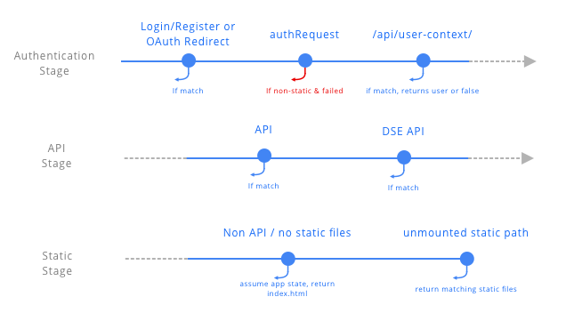

# Autentication
_[back](README.md)_

## Request Flow

The web-server request flow have three main stages, **Authentication**, **API**, and **Static**. 

The flow is implemented in the web-server [start.ts](../services/web-server/src/start.ts) as regular _expressjs_ routers.

**express.js** _routing bindings_ as executed in order of "mounting", hence the importance of the order in which the routers are mounted in the [start.ts](../services/web-server/src/start.ts).  

- **Authentication Stage** 

   - **Login/Register/OAuth** bindings are managing the authentication depending of the request. They all auth the user (if sucessful).
   
   - **[authRequest](../services/web-server/src/web/router-auth-request.ts)** binding authenticate or not the user with the cookie information and put the context in the express.js `request` object. 

   - **[/api/user-context](../services/web-server/src/web/router-auth-userc-context.ts)** holds a little special status as we do not want it to fail on not authenticate request. This API is used for the client to check if the user is logged-in and get basic information.
     > Note: We might clean this up later, by allowing the client API to manage failed request. 

- _... coming soon ..._