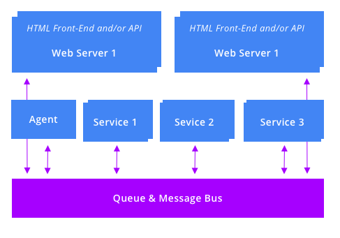

_[home](../README.md)_

# Queue 

The `cloud-starter` Big App pattern is based on a full event-based cloud application architecture, based on [Redis Stream](https://redis.io/topics/streams-intro), which has all services talking to a bus/queue, and avoid any service-to-service direct communication. 

## Overview

Here are the key points of such architecture: 

- Queues are based on [Redis Stream](https://redis.io/topics/streams-intro)
- **Queue event messages** are **fully typed** via TypeScript. (see [event-types.ts](../shared/src/event-types.ts))
- There are two type of queues: 
  - **Application Queues** are data and notification events such as new content available in the store buckets or other application notifications.
  - **Job Queues** are specialized queues that represents work to be done by a service (.e.g., [vid-scaler](../services/vid-scaler/) which scale down a video after it's main MP4 version is vailable). Typically, there isone Job Queue Event type per Job Service. 
- **Job Service** are services that listen to a redis job queue _stream_ with a specific _redis group_, allowing multiple instances of a service to get messages that was not already delivered to another consumer. 
- **Bridges** are processes that bridge two queues, typically an Application Queue with a Job Queue. By best practice, the bridges are usually within their corresponding Job Service container. 
  - For examples: 
    - A [vid-init](../services/vid-init/) job service will create nodejs worker thread to bridge `MediaNew` application event to a `VidInitJob` for any media of type video. See [vid-init/src/wkr-bridge-media-new.ts](../services/vid-init/src/wkr-bridge-media-new.ts)
    - A [vid-scaler](../services/vid-scaler/)  job service will create a new worker thread to bridge `MediaMainMP4` (when the main MP4 is available) to the `VidScalerJob` queue. See [vid-scaler/src/wkr-bridge-media-mp4.ts](../services/vid-scaler/src/wkr-bridge-media-mp4.ts)
  - Best practice: 
    - Bridges are Nodejs Worker Thread, one file per bridge, starting with `wkr-...ts`, and they are started on the appropriate service `start.ts`.

## Redis Stream, Redstream, and Queue APIs intro

- [Redis Stream](https://redis.io/topics/streams-intro) is a persistent list of data maintained by Redis. 
- It allows us to have a full message queue system in a very simple and efficient manner. 
- The Redis Stream APIs start with `X` such as [XADD](https://redis.io/commands/xadd), [XREADGROUP](https://redis.io/commands/xreadgroup).
- The [redstream](https://www.npmjs.com/package/redstream) will be used to query the redis stream server. It uses [ioredis](https://www.npmjs.com/package/ioredis) as backend (which needs to be installed as it is defined as peer dependency)
  - A Stream entry has a `.id` which is typically created by redis on `.xadd(data)` and a `.data` which is TypesScript typed when using _redstream_ 
  - Each Stream has a unique key, e.g., `VidScalerJob` or `MediaNew`, and the Redis API allows adding entries (name/value pair). 
  - With the _redstream_ API, you first create a `redstream` object, with a given key
    - `const mediaNewStream = redstream(ioredisClient, 'MediaNew')` (in application code, a factory module should be used to allow caching, typing, normalization, see [queue.ts](../services/_common/src/queue.ts))
  - Adding new entries is done with `queue.xadd(data)`
    - `mediaNewStream.xadd({type: 'MediaNew', wksId: 11, mediaId: 123, mediaMimeType: 'video/mov'})` (all should typed, see [../shared/src/event-types.ts], and the `.type` property is required and must match the event type name)
  - Reading (blocking) is done with `await stream.xreadgroup(group, consumer)` (where consumer_ID is usually `KHOST`)
    - `group` is a way to group all of the callers so that they only get messages that have not been delivered to another consumer of the same group. 
    - `consumer` allows to identify which client/instance read the message. Typically, this will be the KHOST. (Redis Stream allows to `xinfo` a stream and get that information)
    - `const entry = await mediaNewStream.xreadgroup('VidInitJobBridge', KHOST))`. with `entry = {id:string, data: MediaNew}`. This example is used to bridge the `MediaNew` queue to another queue. 
    - After an entry is read with `xreadgroup` it has to be `xack` to remove it to the pending list of this group once it is deemed processed. This is like an acknowledgment that the entry was processed. This is done with `stream.xack(group, entry.id)`
- `getAppQueue` and `getJobQueue` from [queue.ts](../services/_common/src/queue.ts) are thin application wrapper used to add queue semantic.  
  - `const queue = getAppQueue('MediaNew')` is used to get a use for a specific event type name
  - `queue.next(groupName)` is used to get the next entry. 
  - `jobQueue.nextJob()` is used to get the next entry of a job queue to perform the job (the group name is inferred from the event name)
  - `queue.add({...})` is used to add some data. 
  - All of those are type accordingly to the [../shared/src/event-types.ts]

## Notes

- Right now, the cloud-bigapp code create a new `ioredis` client for each `getAppQueue` call, which could be optimized. 
- However, sharing of `ioredis` client will prevent a call to do a redis call (`.xadd`) if before it had a blocking call. Consequently, all queue are safer, for now, to have their own client until we have an API scheme that allows requesting a "add only" queue interface (i.e., without the `.next..` methods)

