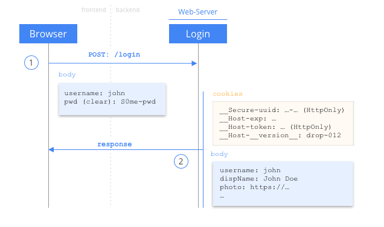
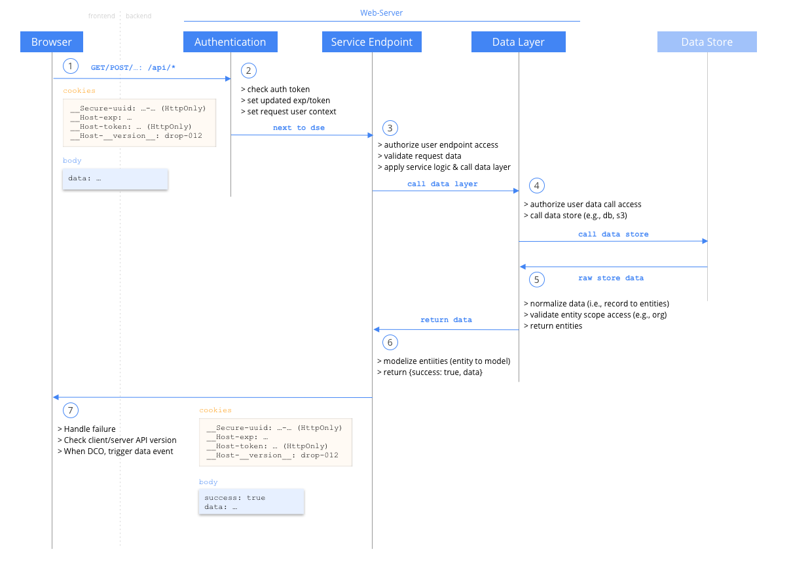

_[home](../README.md)_

# Request Flows with Authentication and Authorization

## Login Flow

- **(1) Browser** - Login Page
  - In the browser, user reach login page, enter username/password
  - **Browser** make ajax `POST: /login` call with body `{username: ..., pwd: ...}` where both are in clear
- **(2) Login** - `POST: /Login`
  - **Purpose:** Valiate  `username` and `pwd`, return auth cookies and user info body
  - **Pseudo code flow: **
    - Get `username`/`pwd` from post body.
    - Get `UserCredential` (with `userCredential = {pwd, uuid, salt}`) from database for the `username`
    - Validate request `clearPwd` from body with encrypted `userCredential.pwd`
      - Validate by calling `pwdFromRequest = pwdEncrypt(clearPwd, userCredential) === userCredential.pwd`
    - If Fail: clear all auth cookies and send `{success:false}`
    - If pass, **Set Auth Cookies**

## Set Auth Cookies

Here is the pseudo code flow of setting a auth cookies for a validated user request or login. 

- New Values
  - `uuid = decodeBase64(cookie.token.firstPart())`
  - `new_exp = now + session_duration`;
  - `new_token_signature = sha256.salt(global_salt + user.salt).update(user.uuid + new_exp).toString('base64')`;
- Set token cookies (only one needed to authenticate request)
  - set cookie - `__Host-token = base64(uuid).base64(new_exp).base64(new_token_signature); Secure; SameSite=Strict; HttpOnly` (Domain locked, HttpOnly)
- Set other cookies (optional, for Web UI features)
  - set cookie - `__Host-exp = new_exp; Secure; SameSite=Strict` (Domain locked, client accessible for UI notification)
  - set cookie - `__Host-__version__ = getServerVersion(); Secure; SameSite=Strict` (Domain locked, usually a drop number, to match with client lib to know if need to reload)
  - set cookie - `__Secure-uuid = user.uuid; Secure; SameSite=Strict; HttpOnly; Domain=my-app.com` (sub domain allowed, to track cdn)

## API Flow

- **(1) Browser**
  - browser make an AJAX API request to web-server
- **(2) Authentication**
  - **Purpose:** For all API requests, check cookies auth-token, update auth-token if pass, and create server `user_context` object on Request for next server processing (Endpoints)
  - **Pseudo code flow:** 
    - Get `UserCredential user` from `cookie.uuid`
    - `expected_token = sha256.salt(global_salt + user.salt).update(user.uuid + cookie.exp).toString('base64')`
    - Validate `exected_token === cookies['__host-token']`
    - If Fail: clear all auth cookies and send `{success:false, error_code: 'INVALID_AUTH'}`
    - If pass, update `Auth Cookies` (see Auth Cookie section)
    - Set `request.context` User Context object. 
    - Go to next request handler (DSE, Data Servie Endpoint)
- **(3) & (6) Service Endpoint**
  - **Purpose:** Handle a REST/Web service endpoint (e.g., REST service Endpoint). 
  - **Pseudo logic flow:**
    - (3) authorize user endpoint access (e.g., only `admin` or `owner` can `POST: api/change-pwd/`. Implemented via decorator/annotation `@AccessRequire('#admin','@cid')` on service enpoint)
    - (3) validate request data (e.g., validate body or param data)
    - (3) apply service logic, calling data layer. 
    - (6) modelize entities (augment/normalize the entities data from the DAOs/DataLayer into model data for the UI or API)
    - (6) return `{success: true, data}`
- **(4) & (5) Data Layer**
  - **Purpose:** CRUD for an given data store and entityp type. (e.g. `projectDao.create(ctx: context, newProjectData)`)
  - **Pseudo logic flow:**
    - (4) authorize user data call access (.e.g. only `admin` or `owner` can `userDao.changePwd(...)`. Implemented via decorator/annotation `@AccessRequire('#admin','@cid')`)
    - (4) call the various data store (e.g., use `knex` for postgres, use `cloud-bucket` for `s3` or `gcp` buckets)
    - (5) normalize data (i.e., record to entities)
    - (5) validate entity scope access (e.g., org)
    - (5) return entity/entities or id (for create)
- **(7) Browser**
  - Get the data as `{success: boolean, data: EndPointData}`
  - Handle failure (i.e., `{success: false, error_code: ..., error_message: ...}`)
  - Check client/server API version (if not, eventually, show a dialog to reload app to have a match)
  - When DCO (Data Client Object) Trigger client pub/sub data event change