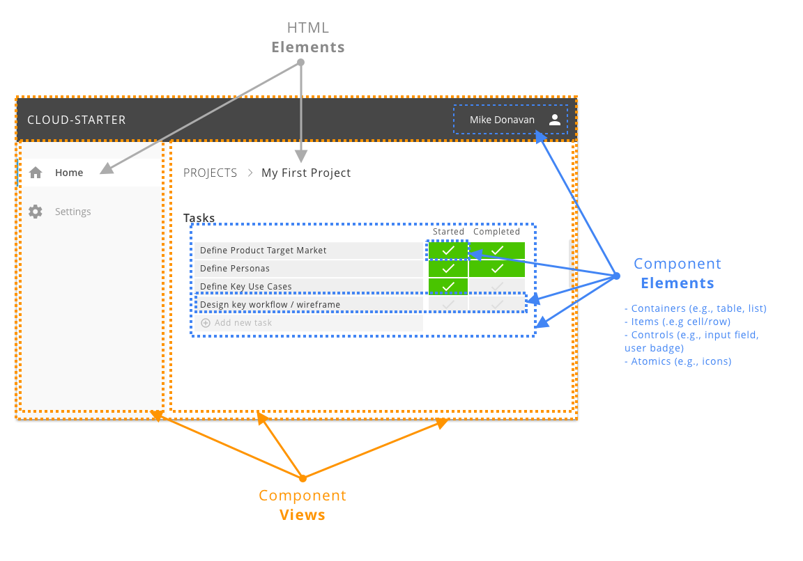

# Web UI Architecture & Patterns
_[back](README.md)_



### DOM Centric Approach

This DOM Centric approach consists of using the DOM as a foundation for a simple, robust, and scalable MVC model.

Components are split into two categories:

  - **Views** are bigger parts of the UI which encapsulates most of the logic and styling at the functional level. Views have a fully asynchronous lifecycle and are responsible for all of the styling and application behaviors (e.g., create/update/delete data items). Views are managed by a DOM Centric micro-library, [mvdom (15kb min)](https://github.com/mvdom/mvdom), which provides fully asynchronous lifecycle management without any DOM Abstraction, allowing Views to fully leverage the DOM Native eventing system.
    > Note: At this point, `mvdom` **views** are not Web Component, but this will change soon. They will still have the same interface as today, with the async workflow (except that they will be added to the DOM when they are by the container logic/display). Those **_web components_ views** will not be shadowDOM (since they belong more to the global application scope, for style and event propagation point of view), but will share all of the other characteristics. They will be registered with something like `<v-main-view><v-main-view>`

  - **Elements** (e.g. `<c-input name='fieldA'></c-input>`are smaller element from generic HTML Elements to customElements/WebComponents and are responsible for atomic functionalities, like a field-input, button, table cells, custom check boxes, and controls type of element. Not everything small HTML element structure needs to be a custom component, for example, a nav item in the left NavView, can just be clean/simple html/css inside the NavView. Things are are reused across views might be made as Web Component, if they have some logic. If just about the display, it might be enough to have a clean `_pcss/ui-...pcss` file. 


### Code Structure

All Web UI applications source code is structure the following way: 

- **services/web-server/web-folder** For each web application, we have a corresponding service (backend) web server with a _web-folder/_ which will be the output directory for the _js_ and _css_ files, as well as root _index.html_ files. 

- **frontends/web/** The _web_ client source code (.ts, .pcss, .tmpl) is located in the _frontends/_ folder structxure with the name of the web app (note: first one being often just 'web', hend the _frontends/web/_)

- UI code used **TypeScript (.ts)** for all logic code, **PostCSS (.pcss)** for all styling code, **Handlebars (.tmpl)** for most templating code beside inline templating for Custom Elements. TypeScript files will be processed by [Rollup](https://github.com/rollup/rollup) with the typing

- UI Code structure, below the **frontends/web/**, follows the following code layout:

  - **`src/_pcss/*.pcss`** Those are the base css files from mixins, CSS Vars, to base styling for the web applications. The folder is prefixed by `_` so that it ran first by the postCSS processor without extra configuration.

  - **`src/ts/*.ts`** All of the main/base TypeScript files for the application level logic and cross view utilities (e.g., `main.ts` to start the app, `ajax.ts` for ajax wrapper, etc...)

  - **`src/views/**/*.[ts/pcss/tmpl]`** All of the views asset. By convention, each views have a `ViewName.ts` (logic/controller, always start with a `div.ViewName`), `ViewName.pcss` (style, scoped from `.ViewName`), and `ViewName.tmpl` (handlebars templates, prefixed with `ViewName-...` when multiple templates fror same view needed). 
    - Most views are organized in one level directory structure based on their names. 
    - View are names from generic-to-specific taxonomy to make the prefix match the folders and to be able to navigate code more effective. For example, `ProjectAddDialog.*` will be used over _AddProjectDialog.*_, which will usually be under a `src/views/Project/` folder.

  - **`src/web-components/*.[ts/pcss]`** All of the CustomElements/WebComponent (minus _shadowDOM_)


### Web Components

With the deprecation of IE11 and Edge move to Google Chrome, Native **WebComponents**, without heavy frameworks (e.g., Angular, React), are now a reality, and can be added to rich **DOM Centric** application development.


- **Custom Elements** is a simple and very robust browser support to efficiently componentized the application custom elements. A good 

- **shadowDom** (not yet) unfortunately _shadowDOM_ styling opacity model adds quite a bit of complexity to application styling, especially for those that want to use great tooling like postCSS. For now, we will start developing the component without _shadowDOM_ first, but we will be following the best practices so that we can adopt it once we have integrated postCSS into our dev cycle (probably with .cpcss, which will be component css put in the templates.js and can be retrieved by appTemplates.css.templateName).

- **Templates** This is another thing that can be useful, although, HTML Templates are not as expressive as handlebars. For now, we will either use inline **string literals** or use the handlebars. Also, Web Components are for atomic components and will be mostly ts/css, as the templating needs are more on the view.  


See [frontends/web/src/web-components c-input example](../frontends/web/src/web-components/c-input.ts)


#### Best practices

For the application development, all custom components will extend at least `BaseHTMLElement` which provided normalized methods and properties (coming soon) to express the component behavior without re-implementing underlying custom elements lifecycle and its intricacies. 

- `src/web-components/c-base.ts` contains the base class that custom component should inherit from.

  - `BaseHTMLElement` provide a basic class for all Sub Classes to inherit from. 
    - Sub Classes implement `init()` to create the innerHTML or appendChild, to set states, and to bind events. It is garanteed to be called only once. 
    - Always called `super.init()` at the beginning of the `init()` SubClass implementation. 
    - Not need to worry about `connectedCallback()` (if called, make sure to call `super.connectedCallback()`)

  - `BaseFieldElement` inherit _BaseHTMLElement_ and provide the basic logic for **field based** Custom Component that have name / value, such as input, checkbox, options, ...
    - Sub Classes needs to manage their `.value` state, and call `this.triggerChange()`, implemented by _BaseFieldElement_, to trigger the DOM `CHANGE` event on the component with `{detail:{name,value}}`. Do not trigger this event manually as _BaseFieldElement_ has some guard for it, just call `this.triggerChange()`.
    - `BaseFieldElement.init` will add the needed `mvdom dx` css class and pusher/puller if the component tag as `.name` and event a generic pusher/puller for all field based custom components. See [SpecControlsView](../frontends/web/src/views/Spec/SpecViews.ts)


#### Custom Elements Spec Summary

For application, do NOT use raw custom elements, but implement at least the BaseHTMLElement with `init()`. 

This is just to explain the underlying behaviors. 

```ts
class MyElement extends HTMLElement{
  // only needed if attributeChangedCallback is used
  static get observedAttributes() {
    return ['disabled', 'open'];
  }

  constructor(){
    super(); // first line, always super();

    // bind events to this. 
    // attach/create shadowDOM if shadowDOM component. 
    // see construtor rules below
  }

  // Called when element is connected to DOM. 
  connectedCallback(){
    super.connectedCallback(); // best pratice
    // create innerHTML if needed but only on first call (can be called multiple time)
  }

  // Called every time the element is removed from the DOM. 
  disconnectedCallback(){}

  // Called when an observed attribute has been added, removed, updated, or replaced
  attributeChangedCallback(attrName, oldVal, newVal){}

  // Called when the custom element has been moved into a new document
  adoptedCallback(){}


}
```

HTMLElement Methods: (see [google doc](https://developers.google.com/web/fundamentals/web-components/customelements), [mozilla doc](https://developer.mozilla.org/en-US/docs/Web/Web_Components/Using_custom_elements)) 

- `constructor() `rules (see [spec](https://html.spec.whatwg.org/multipage/custom-elements.html#custom-element-conformance))
  - A parameter-less call to super() must be the first statement in the constructor body, to establish the correct prototype chain and this value before any further code is run.
  - A return statement must not appear anywhere inside the constructor body, unless it is a simple early-return (return or return this).
  - The constructor must not use the document.write() or document.open() methods.
  - The element's attributes and children must not be inspected, as in the non-upgrade case none will be present, and relying on upgrades makes the element less usable.
  - The element must not gain any attributes or children, as this violates the expectations of consumers who use the createElement or createElementNS methods.
  - In general, work should be deferred to connectedCallback as much as possible—especially work involving fetching resources or rendering. However, note that connectedCallback can be called more than once, so any initialization work that is truly one-time will need a guard to prevent it from running twice.
  - In general, the constructor should be used to set up initial state and default values, and to set up event listeners and possibly a shadow root.
- `connectedCallback()` Called every time the element is inserted into the DOM. Useful for running setup code, such as fetching resources or rendering. Generally, you should try to delay work until this time.
  - Note 1: connectedCallback may be called once your element is no longer connected, use `Node.isConnected` to make sure.
  - Note 2: This will happen each time the node is moved, and may happen before the element's contents have been fully parsed. 
  - Note 3: Since Note 2, if appendChild or innerHTML needs to make sure it is only the first call. 
  - Note 4: Not called in when added/removed from document fragment, and this HTML Template are in documentFragment, won't be called when added in HTML template as well. 
- `disconnectedCallback()` Called every time the element is removed from the DOM. Useful for running clean up code.
  - Note 1: Not called in when added/removed from document fragment.
- `attributeChangedCallback(attrName, oldVal, newVal)` Called when an observed attribute has been added, removed, updated, or replaced. Also called for initial values when an element is created by the parser, or upgraded. 
  - Note 1: only attributes listed in the observedAttributes property will receive this callback.
  - Note 2: can be called before or after the above callbacks depending on how your custom element is used. 
- `adoptedCallback()` The custom element has been moved into a new document (e.g. someone called document.adoptNode(el)).
- CSS Pre-styling unregistered elements, `app-drawer:not(:defined)` see [prestyle](https://developers.google.com/web/fundamentals/web-components/customelements#prestyle)

#### HTML Template & Document Fragments & Custom Elements

Not to be used yet, just as a reference. 

HTML Template hold a HTML DOM for later to be cloned. It is not displayed or rendered, so, it has no layout cost (just html parsing, and custom element expension when added as children).

Run in console in the http://localhost:8080/_spec/controls page

```js
let t1 = document.createElement('template');

// innerHTML, which is the same as if the <template> element is in the page, create the #document-fragment
t1.innerHTML = '<c-input label="fieldZ" value="zzz"></c-input>';
// t1.content is a #document-fragment
// connectedCallback won't be called because document fragment. 

// if we add this template to document body, the components constructor and connectedCallback will NOT get called, because they are in a document-fragment.

// if we add this template to body, and do a t1.appendChild(t1.content);, document fragements element 
// will be moved to regular template children and components constructor and connectedCallback WILL get called.


// If we clone the document fragment (.content) in the DOM, then constructor and connectedCallback WILL get called.
mvdom.first('.spec-form > section').appendChild(t1.content.cloneNode(true));
```