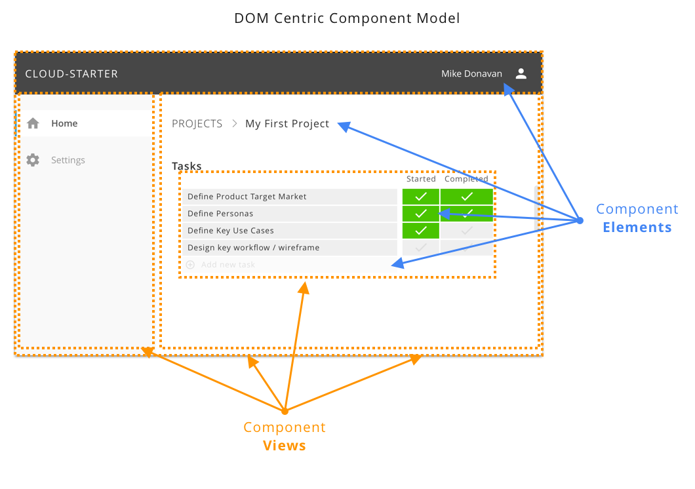

# Web UI Architecture & Patterns

### DOM Centric Approach

This DOM Centric approach consist in using the DOM as a foundation for a simple, robust, and scalable MVC model.

Components are split in two categories:

  - **Views** are bigger part of the UI which encapsulates most of the logic and styling at the functional level. Views have a fully asynchronous lifecycle and are responsible for all of the styling and application behaviors (e.g., create/update/delete data items). Views are managed by a DOM Centric micro-library, [mvdom (15kb min)](https://github.com/mvdom/mvdom), which provides a fully asynchronous lifecycle management without any DOM Abstraction, allowing Views to fully leverage the DOM Native eventing system.

  - **Elements** are smaller element from generic HTML Elements to customElements/WebComponents and are responsible for atomic functionalities, like a field-input, button, table cells, custom check boxes, and controls type of element. Not everything small html element structure needs to be custom component, for example, a nav item in the left NavView, can just be clean/simple html/css inside the NavView. Things are are reused accross views might be made as Web Component, if they have some logic. If just about display, it might be enough to have a clean `_pcss/ui-...pcss` file.

### Code Structure

All Web UI applications source code are structure the following way: 

- **services/web-server/web-folder** For each web application, we have a corresponding service (backend) web server with a _web-folder/_ which will be the output directory for the _js_ and _css_ files, as well as root _index.html_ files. 

- **frontends/web/** The _web_ client source code (.ts, .pcss, .tmpl) is located in the _frontends/_ folder structxure with the name of the web app (note: first one being often just 'web', hend the _frontends/web/_)

- UI code used **TypeScript (.ts)** for all logic code, **PostCSS (.pcss)** for all styling code, **Handlebars (.tmpl)** for most templating code beside inline templating for Custom Elements. TypeScript files will be processed by [Rollup](https://github.com/rollup/rollup) with the typing

- UI Code structure, below the **frontends/web/**, follows the following code layout:

  - **`src/_pcss/*.pcss`** Those are the base css files from mixins, CSS Vars, to base styling for the web applications. The folder is prefix by `_` so that it ran first by the postCSS processor without extra configuration.

  - **`src/ts/*.ts`** All of the main/base TypeScript files for the application level logic and cross view utilities (e.g., `main.ts` to start the app, `ajax.ts` for ajax wrapper, etc...)

  - **`src/views/**/*.[ts/pcss/tmpl]`** All of the views asset. By convention, each views have a `ViewName.ts` (logic/controller, always start with a `div.ViewName`), `ViewName.pcss` (style, scoped from `.ViewName`), and `ViewName.tmpl` (handlebars templates, prefixed with `ViewName-...` when multiple templates fror same view needed). 
    - Most views are organized in one level directory structured based on their names. 
    - View are names from generic-to-specific taxonomy to make the prefix match the folders and to be able to navigate code more effective. For example, `ProjectAddDialog.*` will be used over _AddProjectDialog.*_, which will usually be under a `src/views/Project/` folder.

  - **`src/web-components/*.[ts/pcss]`** All of the CustomElements/WebComponent (minus _shadowDOM_)

### Web Components

With the deprecation of IE11 and Edge move to Google Chrome, Native **WebComponents**, without heavy frameworks (e.g., Angular, React), are now a reality, and can be added to rich **DOM Centric** application development.

- **Custom Elements** is simple and very robust browser support to efficiently componentized the application custom elements. A good 

- **shadowDom** (not yet) unfortunately _shadowDOM_ styling opacity model adds quite a bit of complexity to application styling, especially for those that want to use great tooling like postCSS. For now, we will start developing the component without _shadowDOM_ first, but we will be following the best practices so that we can adopt it once we have integrated postCSS into our dev cycle (probably with .cpcss, which will be component css pute in the templates.js and can be retrieves by appTemplates.css.templateName).

- **Templates** This is another thing that can be useful, althought, HTML Template are not as expressive as handlebars. For now, we will either use inline **string litterals** or use the handlebars. Also, Web Components are for atomic components, and will be mostly ts/css, as the the templating needs are more on the view.  

See [frontends/web/src/web-components c-input example](../frontends/web/src/web-components/c-input.ts)

#### Best practices

- `src/web-components/c-base.ts` contains the base class that custom component should inherit from.

  - `BaseHTMLElement` provide basic class for all Sub Classes to inehrit from. 
    - Sub Classes implement `init()` to create the innerHTML or appendChild, to set states, and to bind events. It is garanteed to be called only once. 
    - Always called `super.init()` at the beginning of the `init()` SubClass implementation. 
    - Not need to worry about `connectedCallback()` (if called, make sure to call `super.connectedCallback()`)

  - `BaseFieldElement` inherit _BaseHTMLElement_ and provide the basic logic for **field based** Custom Component that have name / value, such as input, checkbox, options, ...
    - Sub Classes needs to manage their `.value` state, and call `this.triggerChange()`, implemented by _BaseFieldElement_, to trigger the DOM `CHANGE` event on the component with `{detail:{name,value}}`. Do not trigger this event manually as _BaseFieldElement_ has some guard for it, just call `this.triggerChange()`.
    - `BaseFieldElement.init` will add the needed `mvdom dx` css class and pusher/puller if the component tag as `.name` and event a generic pusher/puller for all field based custom components. See [SpecControlsView](../frontends/web/src/views/Spec/SpecViews.ts)

